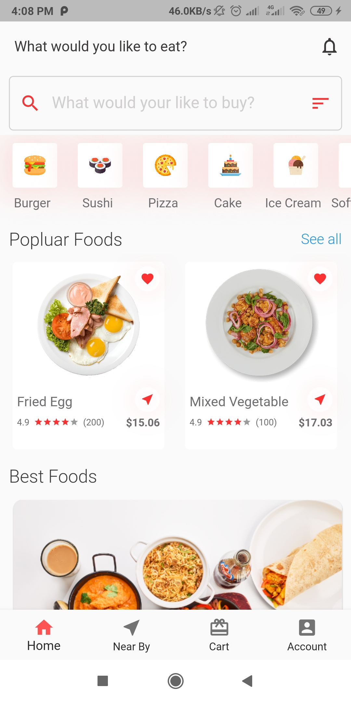
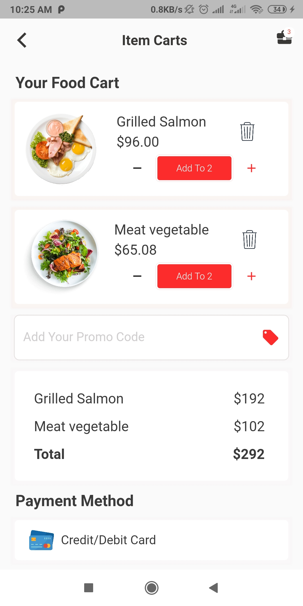
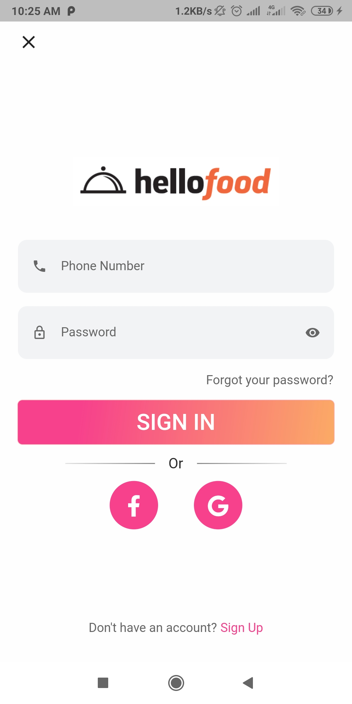
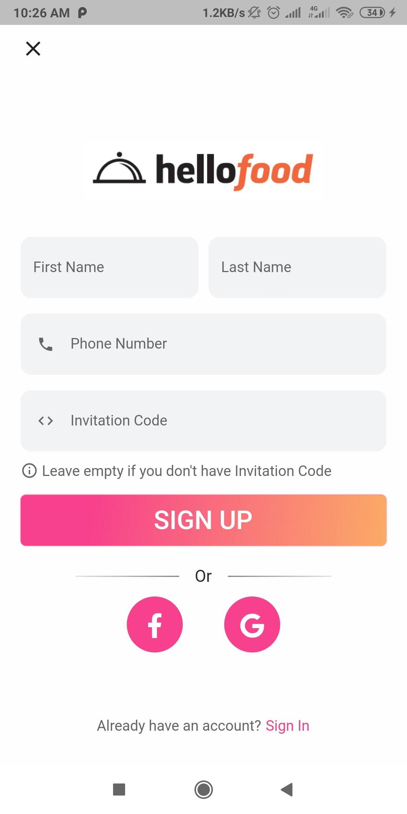

# Food Delivery App

A modern and responsive Food Delivery mobile application built with Flutter for Android and iOS. This project focuses on creating a clean UI, smooth navigation, and an easy food ordering experience.

## Features

* Beautiful and responsive user interface
* Home screen with food categories and popular items
* Food details page
* Add to cart screen
* Login and Registration screens
* Clean navigation flow
* Reusable Flutter widgets

## Tech Stack

* Flutter
* Dart

## Screenshots

### Home Screen



### Food Details & Cart

      

### Login & Registration

      

## Getting Started

### Requirements

* Flutter SDK installed
* Android Studio / VS Code
* Emulator or Physical Device

### Run the Project

```bash
flutter pub get
flutter run
```

## Future Improvements

* Backend integration
* Payment gateway
* Order tracking
* Dark mode
* User profile management

## Author

Deva Harshini Guguloth
